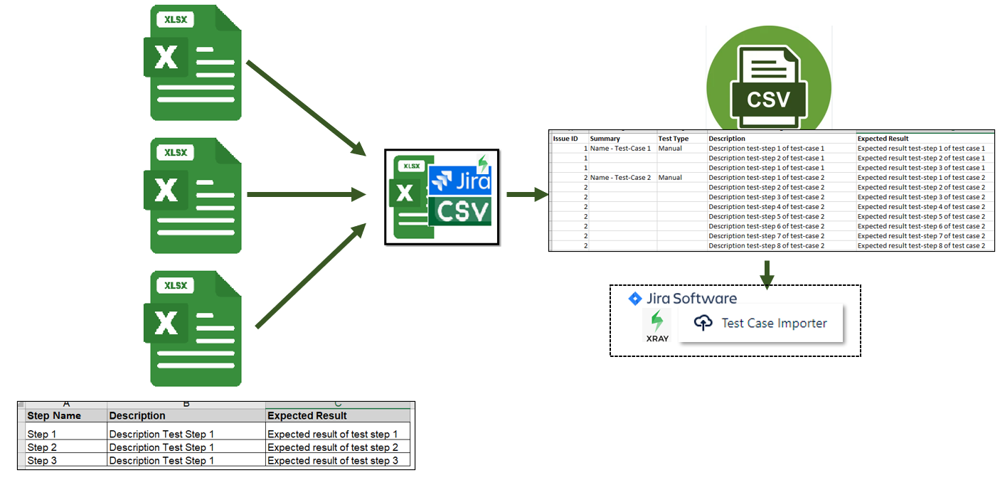

# CreateJiraCsvToImportMultipleTestCasesInXray

- This Program can be used to attach several test-cases in obe big csv file wich can be imported into XRAY. Functionality will be explained in the fallowing picture. 

